# BikeMate 🏍️

Your go-to motorcycle service platform. Book repairs, track mechanics, manage your shop — all from your phone.

## Live Apps

| App | URL |
|-----|-----|
| 🌐 **WebAdmin Portal** | https://webadmin-production-1db8.up.railway.app |
| 🔌 **API** | https://api-production-02d4.up.railway.app |
| ❤️ **Health Check** | https://api-production-02d4.up.railway.app/api/health |

---

## Screenshots

### 🌐 WebAdmin Portal (System Admin)
| Login Page | Dashboard |
|-----------|-----------|
| 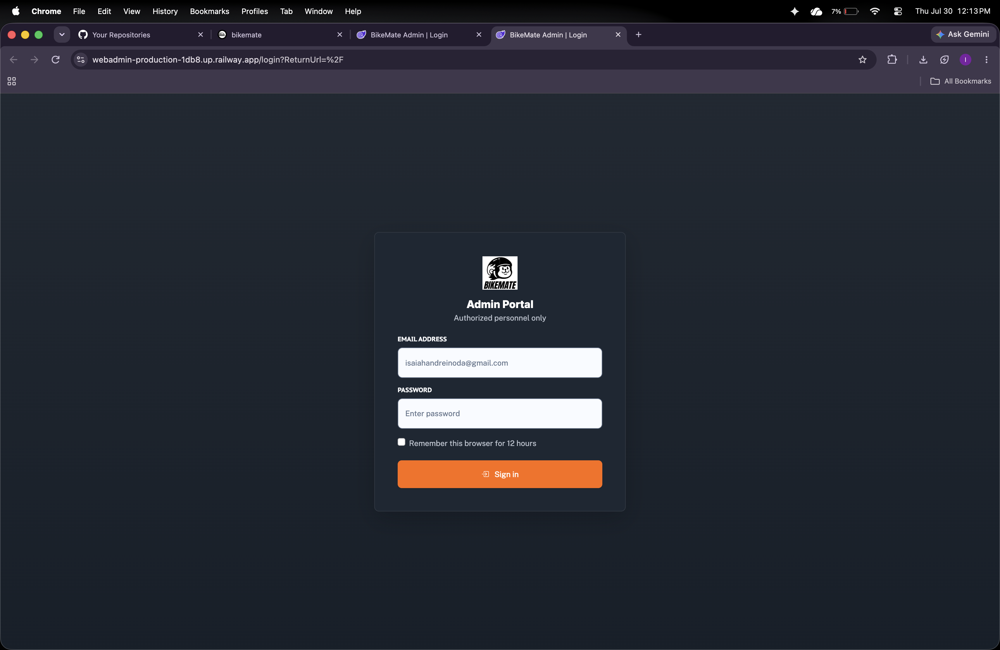 | 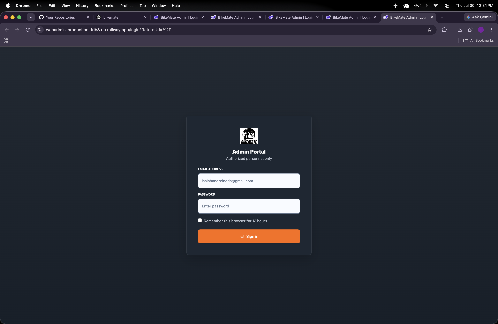 |

### 📱 BikeMate App (Customer)
| Login | Dashboard | Booking | Navigation |
|-------|-----------|---------|------------|
| 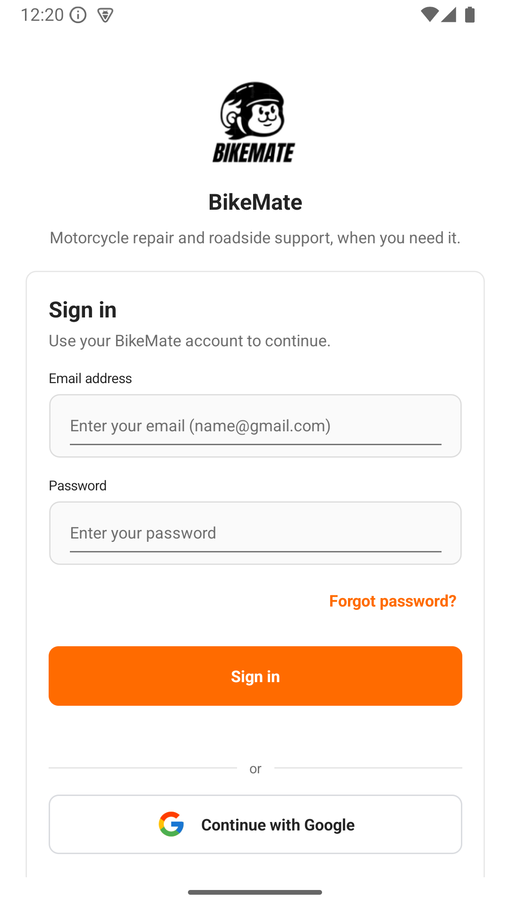 | 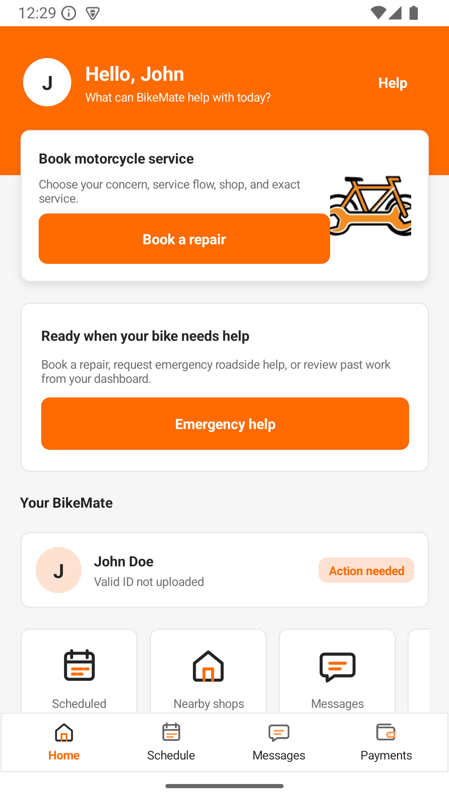 | 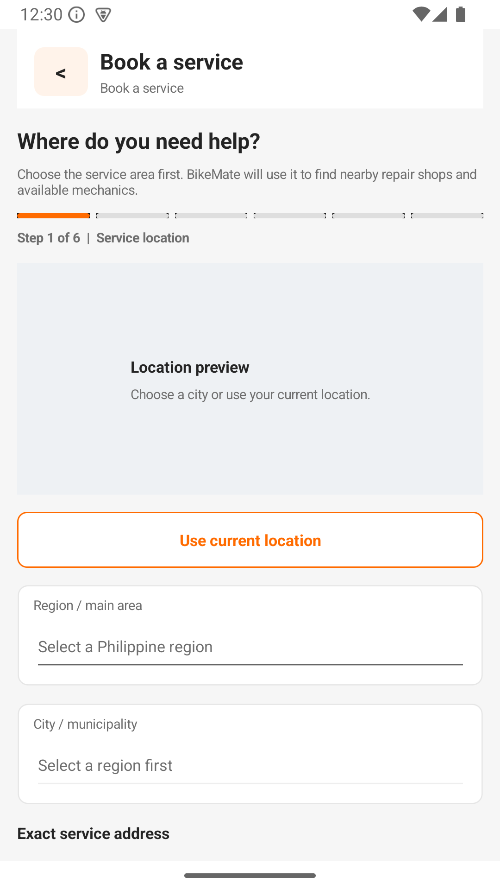 | 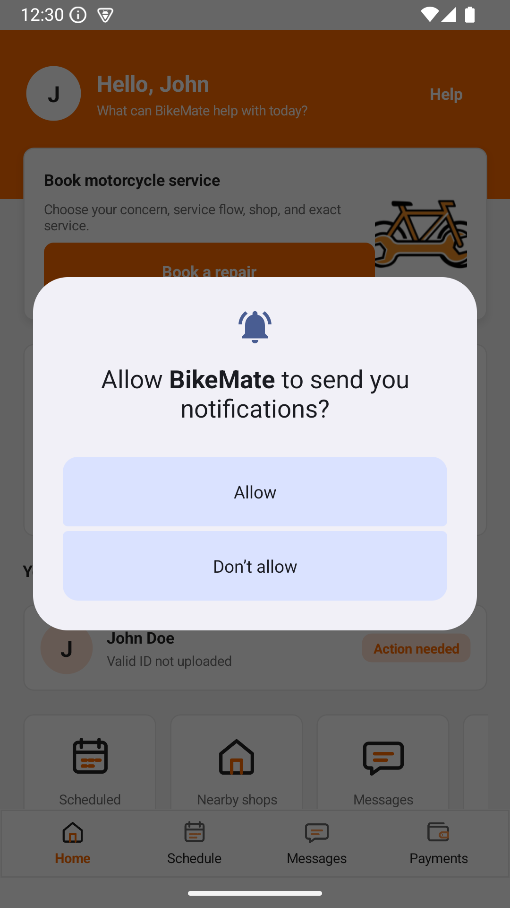 |

### 🛠️ BikeMate App (Mechanic)
| Dashboard | Jobs | Messages |
|-----------|------|----------|
| 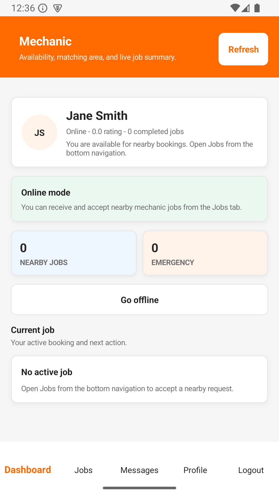 | 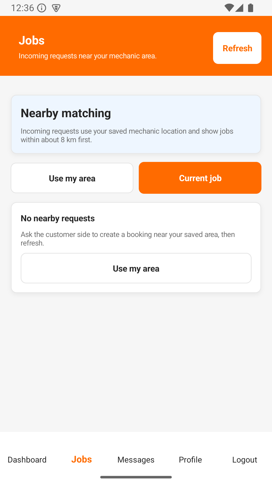 | 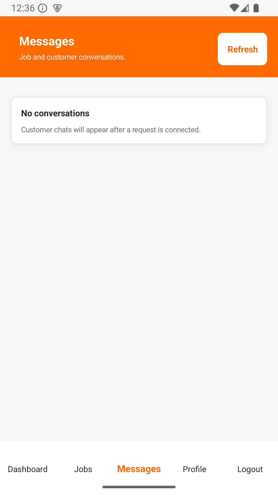 |

### 🏪 BIKEMATES_ADMIN App (Shop Owner)
| Shop Setup - Identity | Shop Setup - Products | Shop Setup - Services |
|----------------------|----------------------|----------------------|
| 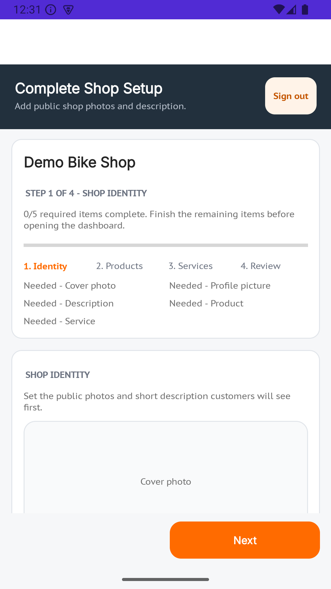 | 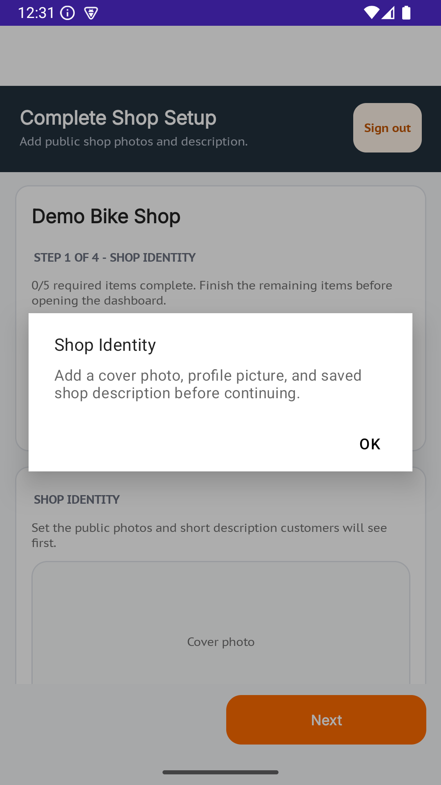 |  |

### 📹 Agora (Video/Voice Calls)
| Call Screen |
|-------------|
| *[Add Agora call screenshot here]* |

---

## What's Inside

- **BikeMate.Mobile** — Android app for **customers & mechanics** (book repairs, track jobs, chat)
- **BIKEMATES_ADMIN** — Android app for **shop owners** (manage services, products, staff, setup shop)
- **BikeMate.WebAdmin** — Web dashboard for **system admins**
- **BikeMate.Api** — Backend API (auth, payments, uploads, real-time chat with Agora)
- **BikeMate.Core** — Shared code (data models, contracts)
- **BikeMate.Infrastructure** — Database setup & migrations
- **BikeMate.Tests** — 109 passing tests

---

## Test Accounts

All accounts use password **`Demo123!`**

| Role | Email | What you can do |
|------|-------|-----------------|
| 👤 **Customer** | `customer1@bikemate.test` | Browse shops, book repairs, emergency help |
| 🔧 **Mechanic** | `mechanic1@bikemate.test` | Accept jobs, update repair status, video calls |
| 🏪 **Shop Owner** | `shop1@bikemate.test` | Manage shop, services, products, staff |
| ⚙️ **System Admin** | `isaiahandreinoda@gmail.com` | Full access to WebAdmin portal |

---

## Build Android Apps

```bash
dotnet build BikeMate.Mobile/BikeMate.Mobile.csproj -f net10.0-android -p:Configuration=Release
dotnet build BIKEMATES_ADMIN/BIKEMATES_ADMIN.csproj -f net10.0-android -p:Configuration=Release
```

The apps connect to the cloud API automatically. To use a different URL:
```bash
dotnet build ... -p:BikeMateApiBaseUrl="https://your-api-url.com/api/"
```

---

## Deploy to Railway

```bash
railway up -s api -d         # Deploy API
railway up -s webadmin -d    # Deploy WebAdmin
```

Set secrets with `railway variable set KEY=value` — never commit them to code.
